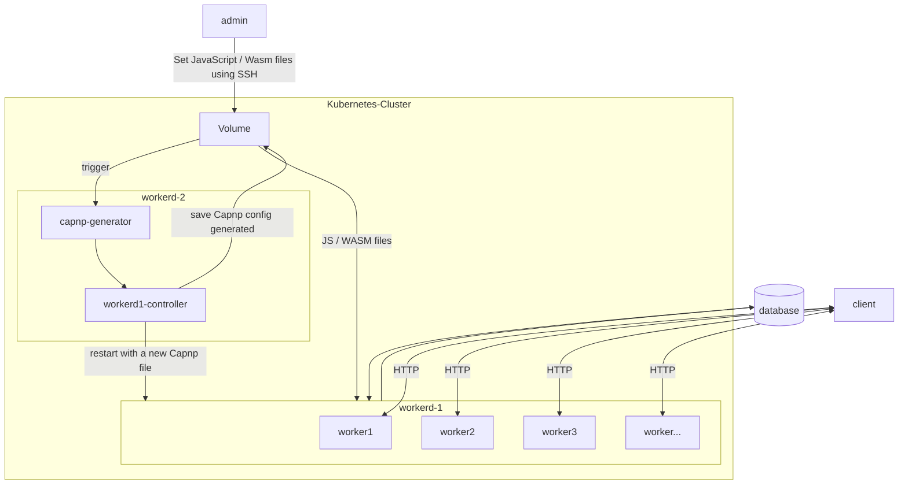

# api-example

this example shows how to build a javascript container using cloudflare workers.
it serves to see all the limits and possibilities.

## Overview

1. [Try on your machine](#try-on-your-machine)
   1. [Install it](#install-it)
   2. [Run it](#run-it)
2. [Try inside a docker image](#try-inside-a-docker-image)
   1. [Build it](#build-the-docker-image)
   2. [Run it](#run-the-docker-image)
   3. [Push the docker image to GitHub](#push-the-docker-image-to-github)
3. [Kubernetes](#kubernetes)
4. [Explanation](#explanation)
   1. [The API](#the-api)
   2. [The Databases](#the-databases)
      1. [MongoDB](#mongodb)
      2. [NeonDB](#neondb)
      3. [Turso](#turso)
   3. [Configure it yourself](#configure-it-yourself)
5. [Cloud Architecture]

## Try on your machine

### Install it

run `yarn` or `npm install` depending on which package manager you use.

then you have to put a secret to wrangler to be able to communicate with the DB as below:
`yarn wrangler secret put DATABASE_URL`. This command will ask you the value of this secret, so put it.

### Run it

run `npm install -g wrangler` then `npx wranger dev src/index.ts`

## Try inside a docker image

### Build the docker image

At the root of the project, run `docker-buildx build --tag=artist-worker .`

you can also use the Makefile by running `make build-docker`

### Run the docker image

once the step [build the docker image](#build-the-docker-image) is ok, you can now
run `docker run -p 8080:8080 artist-worker`. 
you can then run in another terminal `curl 127.0.0.1:8080` with all different routes 
of [The API](#the-api) !

you can also use the Makefile by running `make build-run-docker`, it will always build the image
before running it.

### Push the docker image to GitHub

follow this [link from dev.to](https://dev.to/github/publishing-a-docker-image-to-githubs-container-repository-4n50)
or this [link from official GitHub documentation](https://docs.github.com/en/packages/working-with-a-github-packages-registry/working-with-the-container-registry)

## Kubernetes

before apply all the file, follow this [link](https://kind.sigs.k8s.io/docs/user/ingress/#ingress-nginx).
You'll see how to create the cluster with kind with all ports to open and how to install ingress-nginx.

You can find the kubernetes files in the `kubernetes` folder.
you can run the command `make build-push-docker` to apply all of them.

if you want to delete all ressources in your cluster, run `make delete-kubernetes-ressources`

## Explanation

### The API

the API is managed by the `itty-router` module which is compatible with cloudflare Workers.
it has 4 routes:
- `/helloworld` which only returns helloworld
- `/showArtist/:artist`, instead of `:artist` you put the artist you want to display
- `/addArtist/:artist`, instead of `:artist` you put the artist you want to register
- `/getAllArtists/`, to display all artists registered

### The Databases

#### MongoDB

We cannot use MongoDB directly because Workers only supports HTTP requests, we need to follow this 
[link](https://www.mongodb.com/developer/products/atlas/cloudflare-worker-rest-api/)

#### NeonDB

Thanks to their native REST API, we can directly communicate with the database.
It's used in this example to see how we can store data to create a stateful API.

#### Turso

Turso is the most powerful database I will use in this kind of project.
see here for more information : [Turso](https://chiselstrike.com/)

### Configure It Yourself

There is a [cap'n'proto](https://capnproto.org) file to configure all workers and sockets.

in this example, it runs 2 workers in the same runtime, and it works using only 10 Mo memory!
if you want to test it with a bigger configuration, let's see this 
[GitHub Repo](https://github.com/clementreiffers/capnp-generator).

> **Note**
> By default, there is a limitation of 128 Mo per workers
> with the worker example `src/index.ts` you can run only approximately 700 workers
> at the same time instead of 3000 with the worker `worker2/index.js` 

## Cloud architecture

in order to optimize all the process, we can think of a context like that :

this schema could evolve because of workers that can use only HTTP requests.
To save the capnp file, we will maybe save it into a database fetch-able using HTTP only.
